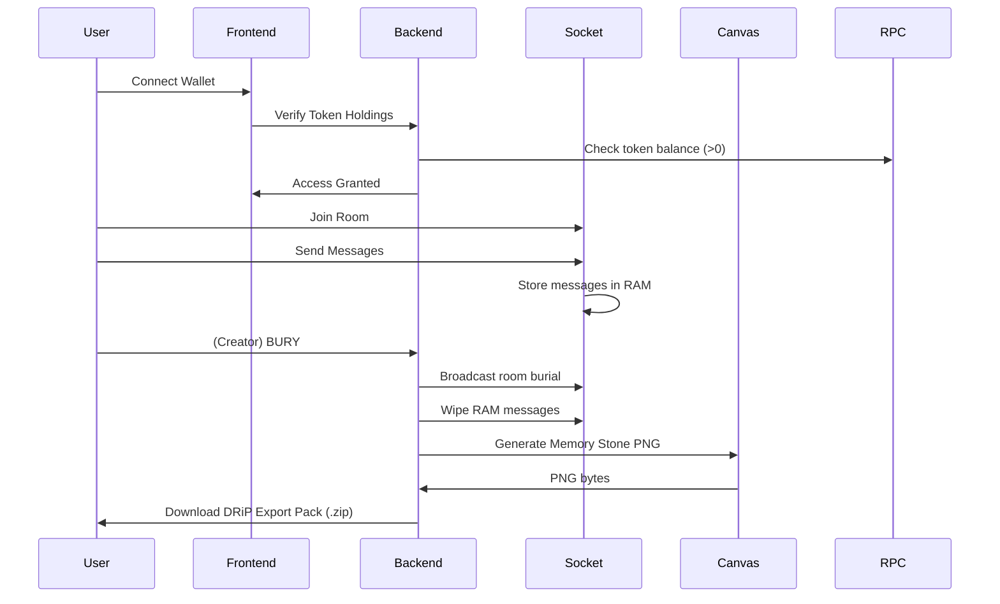

# 🪦 SolitudeRooms — Token-Gated Ephemeral Social on Solana (Devnet)

**SolitudeRooms** is a terminal-style SocialFi platform built on Solana Devnet where communities gather in token-gated chat rooms with **RAM-only messaging**.  
When a room is **buried**, all chat data is permanently erased and a **DRiP-ready collectible Memory Stone** is generated.

> **Tagline:** *Ephemeral conversations. Permanent memories.*

---

## Table of Contents
- [Core Concept](#core-concept)
- [How It Works](#how-it-works)
- [System Architecture](#system-architecture)
- [Room Lifecycle](#room-lifecycle)
- [Token-Gated Access](#token-gated-access)
- [Burial Mechanism](#burial-mechanism)
- [Memory Stone Generator](#memory-stone-generator)
- [DRiP Integration](#drip-integration)
- [Solana Integration](#solana-integration)
- [API & Socket Events](#api--socket-events)
- [Project Structure](#project-structure)
- [Deployment](#deployment)
- [Environment Variables](#environment-variables)
- [Demo Flow](#demo-flow)
- [Privacy Model](#privacy-model)
- [Sponsors Used](#sponsors-used)

---

## Core Concept

Traditional social apps store everything forever. SolitudeRooms stores **nothing**.

- ✅ Token-gated communities
- ✅ No database
- ✅ RAM-only ephemeral chat
- ✅ Creator-controlled burial
- ✅ DRiP-ready collectible export pack

Only a collectible memory remains.

---

## How It Works

1) **Connect wallet** on Solana Devnet.  
2) Paste a **token mint (CA)**.  
3) App **scans token metadata** (name/symbol/decimals) to improve UX.  
4) App **verifies holdings**: wallet must hold `> 0` of the token mint.  
5) Creator **creates a room** (free).  
6) Users **chat** (messages exist only in server RAM).  
7) Creator presses **BURY**:
   - Messages are wiped from RAM
   - A pixel-art **Memory Stone** PNG is generated
   - A **DRiP export pack** ZIP is generated for download

---

## System Architecture

```mermaid
flowchart LR
    U[User Wallet] -->|Connect| FE[Next.js Frontend]
    FE -->|HTTP API| BE[Express Backend]
    FE -->|WebSocket| WS[Socket.io Server]

    BE -->|JSON-RPC| RPC[Helius Devnet RPC]
    BE -->|Render PNG| CE[Canvas Engine]
    CE --> ZIP[DRiP Export Pack (.zip)]

    ZIP --> FE
    FE -->|Download| U

    U -->|Upload Pack| DRIP[DRiP Studio]
```

### Components

| Layer | Technology | Responsibility |
|------:|------------|----------------|
| Frontend | Next.js + Tailwind | UI, wallet connect, token UX, download pack |
| Backend | Express | Verify, token info, pack generation |
| Realtime | Socket.io | Rooms, presence, RAM-only chat stream |
| Blockchain | Solana Devnet + Helius RPC | Identity & token gating |
| Graphics | Node Canvas | Pixel-art Memory Stone image rendering |
| Collectibles | DRiP workflow | Publishing via DRiP Studio |

---

## Room Lifecycle



---

## Token-Gated Access

Users must hold **> 0 tokens** of a given mint to enter a room.

Implementation details:

- Wallet identity via Solana Wallet Adapter
- Balance check via Solana RPC (`getParsedTokenAccountsByOwner`)
- Token metadata scan via Metaplex Metadata PDA (if present)

Use cases:

- DAO meetings
- NFT holder chats
- Token community announcements
- Limited-time event rooms

---

## Burial Mechanism

Rooms can close by:

- Creator command (MVP)
- Timer (optional)
- Inactivity (optional)

On burial:

- ✅ Messages erased from RAM
- ✅ Presence reset
- ✅ Snapshot created (no chat content)
- ✅ Memory Stone generated
- ✅ DRiP export pack created

---

## Memory Stone Generator

Pixel-art templates:

```
public/assets/stones/stone_1.png … stone_5.png
```

Canvas overlays:

- Token name/symbol
- Room name
- Mint address (short form)
- Timestamp

Output:

- `memory_stone.png` (inside the export pack)

---

## DRiP Integration

SolitudeRooms integrates with DRiP via a **DRiP-ready collectible export workflow**.

Endpoint:

```
GET /api/drip/pack/:snapshotId
```

ZIP contents:

- `memory_stone.png`
- `metadata.json`
- `README.txt`

Publishing workflow:

1) Download the export pack from SolitudeRooms  
2) Open DRiP Studio  
3) Upload `memory_stone.png`  
4) Copy fields from `metadata.json` (name/description/attributes)  
5) Publish when ready

This connects **ephemeral social moments → collectible social artifacts**.

---

## Solana Integration

Used for:

- Wallet identity
- Token gating
- Token metadata scan (optional but improves UX)

RPC provider:

- Helius Devnet RPC

No chat is stored on-chain.

---

## API & Socket Events

### HTTP API (Express)

- `GET /api/token/:mint`
  - Returns token info: `{ name?, symbol?, decimals? }`
- `POST /api/verify`
  - Body: `{ wallet, mint }`
  - Returns: `{ allowed: boolean }`
- `GET /api/drip/pack/:snapshotId`
  - Streams a ZIP file

### Socket.io Events

Client → Server:
- `room:create` `{ creatorWallet, tokenMint, roomName }`
- `room:join` `{ roomId, wallet }`
- `chat:send` `{ roomId, wallet, text }`
- `room:bury` `{ roomId, wallet }`

Server → Client:
- `chat:new` `{ id, wallet, text, time }`
- `room:presence` `{ count }`
- `room:buried` `{ snapshotId, ... }`

---

## Project Structure

```txt
.
├── server.ts                      # Next + Express + Socket.io (single server)
├── src/
│   ├── app/
│   │   ├── layout.tsx             # Providers + global styles
│   │   ├── page.tsx               # UI: wallet, token gate, room, burial
│   │   └── globals.css
│   ├── lib/
│   │   ├── solana.ts              # token info + verify via RPC
│   │   ├── store.ts               # in-memory rooms/messages/snapshots
│   │   ├── stone.ts               # Canvas image renderer
│   │   └── types.ts
│   └── ui/
│       └── WalletProvider.tsx     # Wallet adapter provider
└── public/
    └── assets/
        └── stones/
            ├── stone_1.png
            ├── stone_2.png
            ├── stone_3.png
            ├── stone_4.png
            └── stone_5.png
```

---

## Deployment

### Option A — Railway (Recommended)

Railway supports WebSockets and custom servers, so the entire app can run as a single service.

- Deploy from GitHub
- Add environment variables (below)
- Ensure Canvas dependencies are available on your runtime image (see troubleshooting)

### Option B — Vercel + Separate Socket Server

Vercel does not run custom WebSocket servers in the same way as a Node host.  
If you deploy UI on Vercel, run the backend/socket server on Railway/Fly/Render and set `NEXT_PUBLIC_SOCKET_URL` accordingly.

---

## Environment Variables

Create `.env` (do not commit it):

```env
SOLANA_RPC=https://devnet.helius-rpc.com/?api-key=YOUR_HELIUS_API_KEY
NEXT_PUBLIC_SOLANA_RPC=https://devnet.helius-rpc.com/?api-key=YOUR_HELIUS_API_KEY
NEXT_PUBLIC_DRIP_STUDIO_URL=https://drip.haus/
NODE_ENV=production
```

---

## Demo Flow

1) Connect wallet (Devnet)  
2) Paste token mint (CA)  
3) Verify holdings (> 0)  
4) Create room (free)  
5) Chat (RAM-only)  
6) Bury room (creator-only)  
7) Download DRiP export pack (.zip)  
8) Publish collectible in DRiP Studio  

---

## Privacy Model

SolitudeRooms stores **zero persistent chat data**.

- No database
- No chat logs saved
- Messages erased on burial
- Only the collectible artifact remains

---

## Sponsors Used

Platform:
- Solana Devnet
- Helius RPC

Collectible ecosystem:
- DRiP (collectible publishing workflow via export pack)
